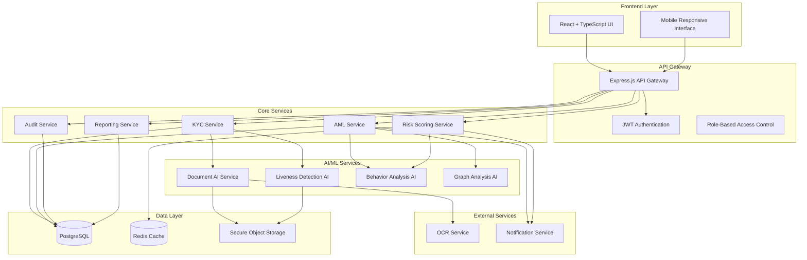

# Compliance Automation Platform - Design Document

## Overview

The Compliance Automation Platform is a microservices-based system that provides end-to-end KYC verification, AML monitoring, and regulatory compliance for FinTech companies. The system uses AI/ML for intelligent decision-making, real-time transaction analysis, and adaptive learning from compliance patterns.

### Architecture Principles
- **Microservices Architecture**: Loosely coupled services for scalability and maintainability
- **Event-Driven Design**: Asynchronous processing for real-time compliance monitoring
- **AI-First Approach**: Machine learning integrated throughout the compliance pipeline
- **Privacy by Design**: Data protection and regulatory compliance built into every component
- **Audit-Ready**: Immutable logging and traceability for regulatory requirements

## Architecture

### System Architecture Diagram



### Technology Stack Implementation

**Frontend Stack:**
- **React 18** with TypeScript for type safety and modern React features
- **Tailwind CSS** for utility-first styling and consistent design system
- **Framer Motion** for smooth animations and micro-interactions
- **Recharts** for compliance dashboards and data visualization
- **React Query** for efficient API state management and caching

**Backend Stack:**
- **Node.js 18+** with Express.js for high-performance API services
- **TypeScript** for type safety across the entire backend
- **Prisma ORM** for type-safe database operations and migrations
- **Redis** for caching risk scores and session management
- **Bull Queue** for background job processing

**AI/ML Stack:**
- **FastAPI** (Python) for AI microservices with automatic API documentation
- **TensorFlow/PyTorch** for deep learning models (document verification, liveness detection)
- **OpenCV** for computer vision tasks (document analysis, face detection)
- **scikit-learn** for traditional ML algorithms (anomaly detection, clustering)
- **NetworkX** for graph-based transaction analysis

**Database Design:**
- **PostgreSQL 14+** as primary database with JSONB support for flexible compliance data
- **Redis 7+** for high-performance caching and real-time data
- **AWS S3/MinIO** for secure document storage with encryption

## Components and Interfaces

### 1. Frontend Components Architecture

```typescript
// Core component structure
src/
├── components/
│   ├── common/           // Reusable UI components
│   ├── kyc/             // KYC-specific components
│   ├── aml/             // AML monitoring components
│   ├── dashboard/       // Dashboard and analytics
│   ├── compliance/      // Compliance reporting
│   └── admin/           // Administrative interfaces
├── hooks/               // Custom React hooks
├── services/            // API service layer
├── stores/              // State management (Zustand)
├── types/               // TypeScript type definitions
└── utils/               // Utility functions
```

**Key Frontend Components:**

1. **KYC Flow Components**
   - `DocumentUpload`: Drag-and-drop interface with progress tracking
   - `LivenessCapture`: Camera interface with real-time feedback
   - `VerificationStatus`: Real-time status tracking with progress indicators
   - `RiskAssessment`: Visual risk score display with explanations

2. **AML Dashboard Components**
   - `TransactionMonitor`: Real-time transaction feed with filtering
   - `RiskHeatmap`: Interactive risk visualization using D3.js
   - `AlertManager`: Alert queue with priority sorting and bulk actions
   - `GraphVisualization`: Network graph for transaction flow analysis

3. **Compliance Components**
   - `AuditTrail`: Searchable, filterable audit log interface
   - `ReportGenerator`: Dynamic report builder with export options
   - `RuleConfiguration`: Visual rule builder for compliance officers
   - `ComplianceMetrics`: KPI dashboard with trend analysis

### 2. Backend Service Architecture

**API Gateway Service (Express.js)**
```typescript
// Core API structure
src/
├── middleware/
│   ├── auth.ts          // JWT authentication
│   ├── rbac.ts          // Role-based access control
│   ├── rateLimit.ts     // API rate limiting
│   └── audit.ts         // Request/response logging
├── routes/
│   ├── kyc.ts           // KYC endpoints
│   ├── aml.ts           // AML monitoring endpoints
│   ├── compliance.ts    // Compliance reporting endpoints
│   └── admin.ts         // Administrative endpoints
├── services/
│   ├── kycService.ts    // KYC business logic
│   ├── amlService.ts    // AML detection logic
│   ├── riskService.ts   // Risk scoring logic
│   └── auditService.ts  // Audit trail management
└── utils/
    ├── encryption.ts    // Data encryption utilities
    ├── validation.ts    // Input validation schemas
    └── logger.ts        // Structured logging
```

**Microservices Communication:**
- **REST APIs** for synchronous operations (KYC status, user queries)
- **Message Queues** (Redis Pub/Sub) for asynchronous processing
- **gRPC** for high-performance inter-service communication (AI services)
- **WebSockets** for real-time updates (dashboard, alerts)

### 3. AI/ML Service Architecture

**Document AI Service (FastAPI)**
```python
# Document verification service structure
app/
├── models/
│   ├── ocr_model.py         # OCR text extraction
│   ├── authenticity_model.py # Document authenticity scoring
│   └── tampering_detector.py # Tampering detection
├── services/
│   ├── document_processor.py # Document processing pipeline
│   ├── validation_service.py # Document validation logic
│   └── scoring_service.py    # Confidence scoring
├── api/
│   ├── document_routes.py    # Document API endpoints
│   └── health_routes.py      # Health check endpoints
└── utils/
    ├── image_processing.py   # Image preprocessing
    ├── feature_extraction.py # Document feature extraction
    └── model_loader.py       # Model management
```

**AI Service Integration Pattern:**
1. **Preprocessing Pipeline**: Image normalization, noise reduction, format standardization
2. **Feature Extraction**: Document-specific feature detection (watermarks, security features)
3. **Model Inference**: Parallel processing of multiple AI models for comprehensive analysis
4. **Confidence Scoring**: Weighted ensemble scoring with explainability metrics
5. **Result Aggregation**: Structured response with confidence intervals and reasoning

## Data Models

### Core Database Schema

```sql
-- Users and Identity
CREATE TABLE users (
    id UUID PRIMARY KEY DEFAULT gen_random_uuid(),
    email VARCHAR(255) UNIQUE NOT NULL,
    phone VARCHAR(20),
    created_at TIMESTAMP DEFAULT NOW(),
    updated_at TIMESTAMP DEFAULT NOW(),
    status VARCHAR(50) DEFAULT 'pending',
    risk_score INTEGER DEFAULT 0,
    kyc_status VARCHAR(50) DEFAULT 'not_started',
    metadata JSONB DEFAULT '{}'
);

-- KYC Verification Records
CREATE TABLE kyc_verifications (
    id UUID PRIMARY KEY DEFAULT gen_random_uuid(),
    user_id UUID REFERENCES users(id),
    document_type VARCHAR(50) NOT NULL,
    document_number VARCHAR(100),
    verification_status VARCHAR(50) DEFAULT 'pending',
    confidence_score INTEGER,
    verification_method VARCHAR(50),
    verified_at TIMESTAMP,
    expires_at TIMESTAMP,
    verification_data JSONB DEFAULT '{}',
    created_at TIMESTAMP DEFAULT NOW()
);

-- Document Storage
CREATE TABLE documents (
    id UUID PRIMARY KEY DEFAULT gen_random_uuid(),
    user_id UUID REFERENCES users(id),
    kyc_verification_id UUID REFERENCES kyc_verifications(id),
    document_type VARCHAR(50) NOT NULL,
    file_path VARCHAR(500) NOT NULL,
    file_hash VARCHAR(64) NOT NULL,
    encryption_key_id VARCHAR(100),
    ocr_data JSONB DEFAULT '{}',
    ai_analysis JSONB DEFAULT '{}',
    created_at TIMESTAMP DEFAULT NOW()
);

-- Transaction Monitoring
CREATE TABLE transactions (
    id UUID PRIMARY KEY DEFAULT gen_random_uuid(),
    user_id UUID REFERENCES users(id),
    transaction_type VARCHAR(50) NOT NULL,
    amount DECIMAL(15,2) NOT NULL,
    currency VARCHAR(3) DEFAULT 'INR',
    counterparty_id UUID,
    transaction_time TIMESTAMP DEFAULT NOW(),
    risk_score INTEGER DEFAULT 0,
    aml_status VARCHAR(50) DEFAULT 'clear',
    metadata JSONB DEFAULT '{}',
    created_at TIMESTAMP DEFAULT NOW()
);

-- AML Alerts
CREATE TABLE aml_alerts (
    id UUID PRIMARY KEY DEFAULT gen_random_uuid(),
    user_id UUID REFERENCES users(id),
    transaction_id UUID REFERENCES transactions(id),
    alert_type VARCHAR(100) NOT NULL,
    severity VARCHAR(20) DEFAULT 'medium',
    status VARCHAR(50) DEFAULT 'open',
    triggered_rules JSONB DEFAULT '[]',
    risk_factors JSONB DEFAULT '{}',
    assigned_to UUID,
    resolved_at TIMESTAMP,
    resolution_notes TEXT,
    created_at TIMESTAMP DEFAULT NOW()
);

-- Audit Trail
CREATE TABLE audit_logs (
    id UUID PRIMARY KEY DEFAULT gen_random_uuid(),
    entity_type VARCHAR(50) NOT NULL,
    entity_id UUID NOT NULL,
    action VARCHAR(100) NOT NULL,
    actor_id UUID,
    actor_type VARCHAR(50),
    changes JSONB DEFAULT '{}',
    metadata JSONB DEFAULT '{}',
    ip_address INET,
    user_agent TEXT,
    created_at TIMESTAMP DEFAULT NOW()
);

-- Compliance Rules
CREATE TABLE compliance_rules (
    id UUID PRIMARY KEY DEFAULT gen_random_uuid(),
    rule_name VARCHAR(200) NOT NULL,
    rule_type VARCHAR(50) NOT NULL,
    conditions JSONB NOT NULL,
    actions JSONB NOT NULL,
    priority INTEGER DEFAULT 1,
    is_active BOOLEAN DEFAULT true,
    jurisdiction VARCHAR(10) DEFAULT 'IN',
    created_by UUID,
    created_at TIMESTAMP DEFAULT NOW(),
    updated_at TIMESTAMP DEFAULT NOW()
);
```

### Redis Data Structures

```typescript
// Risk scoring cache
interface RiskScoreCache {
  userId: string;
  currentScore: number;
  factors: {
    transactionVelocity: number;
    geographicRisk: number;
    behaviorDeviation: number;
    networkRisk: number;
  };
  lastUpdated: Date;
  expiresAt: Date;
}

// Real-time transaction monitoring
interface TransactionStream {
  transactionId: string;
  userId: string;
  amount: number;
  timestamp: Date;
  riskIndicators: string[];
  processingStatus: 'pending' | 'approved' | 'flagged';
}

// Session management
interface UserSession {
  sessionId: string;
  userId: string;
  role: string;
  permissions: string[];
  lastActivity: Date;
  deviceFingerprint: string;
}
```

## Error Handling

### Error Classification and Response Strategy

**1. System Errors**
- **Database Connection Failures**: Automatic retry with exponential backoff
- **AI Service Timeouts**: Fallback to rule-based processing with degraded confidence
- **External API Failures**: Circuit breaker pattern with graceful degradation

**2. Business Logic Errors**
- **Invalid Document Formats**: Clear user feedback with format requirements
- **Insufficient KYC Data**: Progressive disclosure requesting additional information
- **Risk Threshold Violations**: Automatic escalation to manual review queue

**3. Security Errors**
- **Authentication Failures**: Rate limiting with progressive delays
- **Authorization Violations**: Audit logging with immediate alert generation
- **Data Validation Errors**: Sanitization with detailed error messages

### Error Response Format

```typescript
interface ErrorResponse {
  error: {
    code: string;           // Machine-readable error code
    message: string;        // Human-readable error message
    details?: any;          // Additional error context
    timestamp: Date;        // Error occurrence time
    requestId: string;      // Unique request identifier for tracking
    retryable: boolean;     // Whether the operation can be retried
  };
  metadata?: {
    supportContact?: string;
    documentationUrl?: string;
    estimatedResolution?: string;
  };
}
```

### Monitoring and Alerting

**Application Performance Monitoring:**
- **Response Time Tracking**: 95th percentile response times for all endpoints
- **Error Rate Monitoring**: Real-time error rate tracking with threshold alerts
- **Resource Utilization**: CPU, memory, and database connection monitoring

**Business Metrics Monitoring:**
- **KYC Processing Times**: Average and median processing times by verification type
- **AML Alert Accuracy**: False positive rates and alert resolution times
- **Compliance SLA Tracking**: Regulatory reporting deadlines and completion rates

## Testing Strategy

### 1. Unit Testing
**Frontend Testing (Jest + React Testing Library)**
- Component rendering and interaction testing
- Custom hook testing with mock data
- Utility function testing with edge cases
- State management testing (Zustand stores)

**Backend Testing (Jest + Supertest)**
- API endpoint testing with various input scenarios
- Service layer testing with mocked dependencies
- Database operation testing with test database
- Authentication and authorization testing

**AI/ML Testing (pytest)**
- Model accuracy testing with labeled datasets
- Performance benchmarking with various input sizes
- Edge case testing (corrupted images, unusual documents)
- Integration testing with mock API responses

### 2. Integration Testing
**API Integration Testing**
- End-to-end API workflow testing
- Database transaction testing
- External service integration testing
- Message queue processing testing

**AI Service Integration**
- Document processing pipeline testing
- Real-time risk scoring integration
- Alert generation and notification testing
- Audit trail completeness verification

### 3. End-to-End Testing
**User Journey Testing (Playwright)**
- Complete KYC verification flow
- AML alert investigation workflow
- Compliance report generation process
- Administrative configuration changes

**Performance Testing**
- Load testing for high-volume transaction processing
- Stress testing for concurrent KYC verifications
- Scalability testing for database and cache performance
- Security testing for authentication and data protection

### 4. Security Testing
**Penetration Testing**
- Authentication bypass attempts
- SQL injection and XSS vulnerability testing
- Data encryption verification
- Access control validation

**Compliance Testing**
- GDPR compliance verification (data portability, right to erasure)
- PCI DSS compliance for payment data handling
- SOC 2 Type II controls testing
- Regulatory reporting accuracy validation

### Test Data Management
**Synthetic Data Generation**
- Realistic user profiles with various risk characteristics
- Synthetic transaction patterns for AML testing
- Mock document images for AI model testing
- Compliance scenario datasets for rule testing

**Data Privacy in Testing**
- Production data anonymization for testing environments
- Synthetic PII generation for realistic testing scenarios
- Secure test data lifecycle management
- GDPR-compliant test data handling procedures